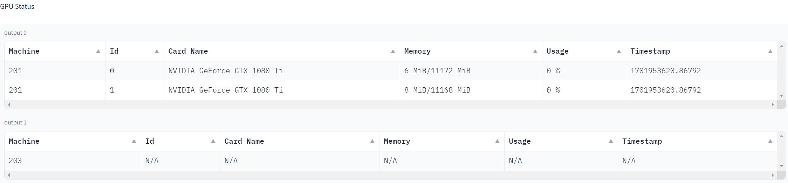

# web-nvidia-smi

A simple python script that can be used to check the remote GPUs.

## Dependences
```
paramiko
pandas
```
## Usage
1. make sure you can login your server via normal `ssh` command.
Recommend to use the `~/.ssh/config` to configure and alias your server's login details.

2. modify the `server.conf` file to fit your own servers, e.g.:

```
192.168.1.2
192.168.1.3
```

3. run `python main.py`, and click the `Generate` button to get the latest GPU infos.

4. if you want to use it from your mobile devices, you can enable the public link via set the `shared=True` in the `gradio_table.GradioAPP` 
## Example
